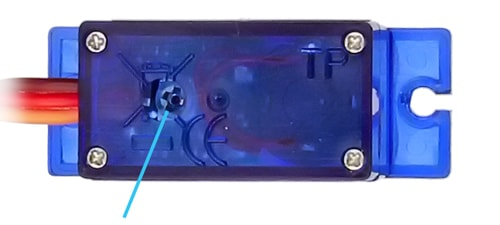

# Trashbin opener

A Sketch to open a trashbin whenever you put your hand in front of a distance sensor

## Used Parts

* [Servo] (<https://www.addicore.com/FS90R-Servo-p/ad314.htm>)
* [Sensor] (<https://cdn.sparkfun.com/datasheets/Sensors/Proximity/HCSR04.pdf>)
* [NodeMcu] (<https://github.com/nodemcu/nodemcu-devkit-v1.0>)

To get the servo to work make sure the potentiometer is adjusted properly as shown below

